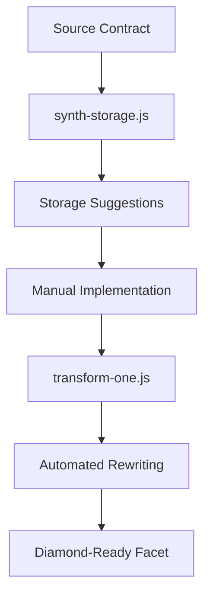

# Synth-Storage.js - Comprehensive Documentation

## Overview

**synth-storage.js** is a sophisticated code analysis tool designed for the PayRox Diamond proxy ecosystem. It analyzes Solidity contracts and generates intelligent suggestions for implementing namespaced storage libraries, which are crucial for safe storage management in Diamond proxy patterns.

## Table of Contents

1. [Purpose & Design Philosophy](#purpose--design-philosophy)
2. [Technical Architecture](#technical-architecture)
3. [Core Functionality](#core-functionality)
4. [Usage & Examples](#usage--examples)
5. [Output Analysis](#output-analysis)
6. [Integration with PayRox Ecosystem](#integration-with-payrox-ecosystem)
7. [Storage Pattern Benefits](#storage-pattern-benefits)
8. [Advanced Use Cases](#advanced-use-cases)
9. [Troubleshooting](#troubleshooting)
10. [Best Practices](#best-practices)

## Purpose & Design Philosophy

### Primary Objectives

**Storage Collision Prevention**: In Diamond proxy patterns, multiple facets share the same storage space. Without proper namespacing, storage variables can collide, leading to data corruption and unexpected behavior.

**Automated Analysis**: Rather than manually identifying which contracts need storage libraries, this tool automatically scans Solidity contracts and identifies candidates for storage refactoring.

**Consistent Patterns**: Ensures all PayRox facets follow the same storage organization patterns, making the codebase more maintainable and reducing the risk of storage-related bugs.

### Design Philosophy

```javascript
// Core principle: Zero-assumption analysis
const hasState = node.subNodes.some((sn) => sn.type === 'StateVariableDeclaration');
```

The tool follows a **zero-assumption approach**:
- Analyzes contracts without prior knowledge of their structure
- Makes conservative suggestions based on detected state variables
- Provides actionable recommendations without making destructive changes

## Technical Architecture

### Dependencies

```javascript
const fs = require('fs');
const path = require('path');
let parser;
try {
  parser = require('@solidity-parser/parser');
} catch (e) {
  console.error('Please install @solidity-parser/parser');
  process.exit(1);
}
```

**@solidity-parser/parser**: Industrial-strength Solidity AST parser that handles:
- Complex contract hierarchies
- Multiple inheritance patterns
- Error-tolerant parsing for partial/malformed code
- Location tracking for precise source mapping

### Core Architecture Components

#### 1. **Timestamp-Based Output Organization**

```javascript
function timestamp() {
  return new Date().toISOString().replace(/[:.]/g, '-');
}

function ensureOutDir() {
  const out = path.resolve('.payrox/generated/transformers', timestamp());
  fs.mkdirSync(out, { recursive: true });
  return out;
}
```

**Purpose**: Creates unique output directories for each analysis run
**Benefits**: 
- Prevents output collision between multiple runs
- Maintains historical analysis results
- Enables diff comparison between analysis runs
- Provides audit trail for transformation decisions

#### 2. **AST-Based Contract Analysis**

```javascript
parser.visit(ast, {
  ContractDefinition(node) {
    const name = node.name;
    const hasState = node.subNodes.some((sn) => sn.type === 'StateVariableDeclaration');
    if (hasState) {
      suggestions.push({
        contract: name,
        storageLib: `${name}Storage`,
        slot: `keccak256(abi.encodePacked("${name}.storage"))`,
        note: 'Suggest synthesize storage lib and rewrite S.x to Layout(SLOT).x',
      });
    }
  },
});
```

**Analysis Strategy**:
- **Contract-by-contract traversal**: Each contract is analyzed independently
- **State variable detection**: Identifies contracts that declare storage variables
- **Naming convention**: Follows PayRox standard of `{ContractName}Storage`
- **Slot calculation**: Uses deterministic slot naming for consistent storage layout

## Core Functionality

### Input Processing

```bash
node synth-storage.js contracts/MyFacet.sol
```

**File Reading**: Reads Solidity source files with UTF-8 encoding
**Error Handling**: Graceful handling of file system errors and parse failures
**Path Resolution**: Accepts relative and absolute file paths

### AST Analysis Pipeline

#### Phase 1: Parsing
```javascript
let ast;
try {
  ast = parser.parse(src, { tolerant: true });
} catch (e) {
  console.error('Parse error:', e);
  process.exit(2);
}
```

**Tolerant Parsing**: Continues analysis even with minor syntax errors
**Error Recovery**: Provides meaningful error messages for debugging
**AST Generation**: Creates traversable abstract syntax tree

#### Phase 2: Contract Discovery
```javascript
ContractDefinition(node) {
  const name = node.name;
  const hasState = node.subNodes.some((sn) => sn.type === 'StateVariableDeclaration');
  // ...
}
```

**Contract Enumeration**: Identifies all contract definitions in the file
**State Analysis**: Determines which contracts have storage requirements
**Inheritance Awareness**: Considers inherited state variables (implicit)

#### Phase 3: Suggestion Generation
```javascript
suggestions.push({
  contract: name,
  storageLib: `${name}Storage`,
  slot: `keccak256(abi.encodePacked("${name}.storage"))`,
  note: 'Suggest synthesize storage lib and rewrite S.x to Layout(SLOT).x',
});
```

**Recommendation Creation**: Generates actionable storage library suggestions
**Naming Conventions**: Follows PayRox standards for consistency
**Implementation Guidance**: Provides clear next steps for developers

### Output Generation

#### 1. **JSON Report (changes.json)**
```json
[
  {
    "contract": "PaymentProcessor",
    "storageLib": "PaymentProcessorStorage",
    "slot": "keccak256(abi.encodePacked(\"PaymentProcessor.storage\"))",
    "note": "Suggest synthesize storage lib and rewrite S.x to Layout(SLOT).x"
  }
]
```

**Machine-Readable**: Structured data for automated processing
**Integration-Ready**: Can be consumed by other PayRox tools
**Detailed Metadata**: Includes all necessary information for implementation

#### 2. **Markdown Summary (report.md)**
```markdown
File: contracts/PaymentProcessor.sol
Suggested storage synth: 1 items
```

**Human-Readable**: Quick overview of analysis results
**Documentation**: Can be included in project documentation
**Summary Statistics**: High-level metrics for decision making

#### 3. **Source Backup**
```javascript
fs.writeFileSync(path.join(out, path.basename(file)), src, 'utf8');
```

**Version Control**: Preserves original source at time of analysis
**Audit Trail**: Enables tracking of changes over time
**Safety Net**: Backup in case of transformation errors

## Usage & Examples

### Basic Usage

```bash
# Analyze a single facet
node scripts/tools/transformers/synth-storage.js contracts/facets/TokenFacet.sol

# Analyze core contract
node scripts/tools/transformers/synth-storage.js contracts/PayRoxProxy.sol

# Analyze utility contract
node scripts/tools/transformers/synth-storage.js contracts/utils/AccessControl.sol
```

### Example Analysis Results

#### Input Contract
```solidity
// contracts/facets/TokenFacet.sol
pragma solidity 0.8.30;

contract TokenFacet {
    mapping(address => uint256) private _balances;
    mapping(address => mapping(address => uint256)) private _allowances;
    uint256 private _totalSupply;
    string private _name;
    string private _symbol;
    
    function transfer(address to, uint256 amount) external returns (bool) {
        // implementation
    }
}
```

#### Generated Suggestion
```json
{
  "contract": "TokenFacet",
  "storageLib": "TokenFacetStorage",
  "slot": "keccak256(abi.encodePacked(\"TokenFacet.storage\"))",
  "note": "Suggest synthesize storage lib and rewrite S.x to Layout(SLOT).x"
}
```

#### Recommended Implementation
```solidity
library TokenFacetStorage {
    bytes32 internal constant SLOT = keccak256("TokenFacet.storage");
    
    struct Layout {
        mapping(address => uint256) _balances;
        mapping(address => mapping(address => uint256)) _allowances;
        uint256 _totalSupply;
        string _name;
        string _symbol;
    }
    
    function layout() internal pure returns (Layout storage l) {
        bytes32 slot = SLOT;
        assembly { l.slot := slot }
    }
}

contract TokenFacet {
    function transfer(address to, uint256 amount) external returns (bool) {
        TokenFacetStorage.Layout storage s = TokenFacetStorage.layout();
        // Use s._balances instead of _balances
        // Use s._totalSupply instead of _totalSupply
        // etc.
    }
}
```

## Output Analysis

### Directory Structure
```
.payrox/
└── generated/
    └── transformers/
        └── 2025-08-20T08-03-26-571Z/
            ├── changes.json      # Machine-readable suggestions
            ├── report.md         # Human-readable summary
            └── TokenFacet.sol    # Source backup
```

### Understanding Suggestions

#### Contract Field
- **Purpose**: Identifies the contract that needs storage refactoring
- **Usage**: Use this name when implementing the storage library
- **Example**: `"contract": "TokenFacet"`

#### StorageLib Field
- **Purpose**: Suggested name for the storage library
- **Convention**: `{ContractName}Storage`
- **Usage**: Create a library with this exact name
- **Example**: `"storageLib": "TokenFacetStorage"`

#### Slot Field
- **Purpose**: Deterministic storage slot calculation
- **Formula**: `keccak256(abi.encodePacked("{ContractName}.storage"))`
- **Benefits**: Prevents storage collisions between facets
- **Example**: `"slot": "keccak256(abi.encodePacked(\"TokenFacet.storage\"))"`

#### Note Field
- **Purpose**: Implementation guidance
- **Pattern**: `S.x` → `Layout(SLOT).x`
- **Meaning**: Replace direct state access with namespaced access
- **Example**: `_balances[msg.sender]` → `s._balances[msg.sender]`

## Integration with PayRox Ecosystem

### Workflow Integration



### Tool Chain Compatibility

#### 1. **Pre-Processing Phase**
- **synth-storage.js**: Identifies storage refactoring candidates
- **hoist-modifiers.js**: Suggests modifier organization
- **constructor-to-initialize.js**: Converts constructors to initializers

#### 2. **Implementation Phase**
- Manual storage library creation based on suggestions
- Code review and validation
- Testing with namespaced storage

#### 3. **Post-Processing Phase**
- **transform-one.js**: Automated state variable rewriting
- **Compilation**: Verification of storage layout
- **Deployment**: Diamond proxy integration

### PayRox Storage Standards

#### Naming Conventions
```javascript
// Library naming
const libName = `${contractName}Storage`;

// Slot naming
const slotKey = `${contractName}.storage`;

// Layout struct
struct Layout {
    // Original state variables
}
```

#### Storage Isolation
```solidity
// Each facet gets isolated storage
library TokenFacetStorage {
    bytes32 internal constant SLOT = keccak256("TokenFacet.storage");
    // ...
}

library GovernanceFacetStorage {
    bytes32 internal constant SLOT = keccak256("GovernanceFacet.storage");
    // ...
}
```

## Storage Pattern Benefits

### 1. **Collision Prevention**

**Problem**: Multiple facets sharing storage space
```solidity
// BAD: Storage collision risk
contract FacetA {
    uint256 value;  // slot 0
}

contract FacetB {
    uint256 amount; // slot 0 - COLLISION!
}
```

**Solution**: Namespaced storage
```solidity
// GOOD: Isolated storage
library FacetAStorage {
    bytes32 internal constant SLOT = keccak256("FacetA.storage");
    struct Layout { uint256 value; }
    function layout() internal pure returns (Layout storage l) {
        bytes32 slot = SLOT;
        assembly { l.slot := slot }
    }
}
```

### 2. **Upgrade Safety**

**Problem**: Storage layout changes break upgrades
```solidity
// Version 1
contract Facet {
    uint256 a;  // slot 0
    uint256 b;  // slot 1
}

// Version 2 - BROKEN
contract Facet {
    uint256 b;  // slot 0 - Wrong!
    uint256 a;  // slot 1 - Wrong!
    uint256 c;  // slot 2
}
```

**Solution**: Append-only storage
```solidity
library FacetStorage {
    struct Layout {
        uint256 a;  // Never reorder
        uint256 b;  // Never reorder
        uint256 c;  // Only append new fields
    }
}
```

### 3. **Development Efficiency**

**Before**: Manual storage management
- Calculate storage slots manually
- Risk of human error in slot assignment
- Difficult to detect collisions

**After**: Automated analysis
- Tool identifies refactoring needs
- Consistent naming conventions
- Automated collision prevention

### 4. **Code Maintainability**

**Centralized Storage**: Each facet's storage is clearly defined
**Clear Dependencies**: Easy to see what storage each facet uses
**Isolated Changes**: Modifications to one facet don't affect others

## Advanced Use Cases

### 1. **Multi-Facet Analysis**

```bash
# Analyze all facets in a directory
for file in contracts/facets/*.sol; do
    node scripts/tools/transformers/synth-storage.js "$file"
done
```

### 2. **Inheritance Handling**

The tool identifies contracts with state variables, including those that might inherit from others:

```solidity
contract BaseFacet {
    uint256 internal baseValue;  // Detected
}

contract TokenFacet is BaseFacet {
    mapping(address => uint256) private _balances;  // Detected
    // Tool suggests TokenFacetStorage including inherited variables
}
```

### 3. **Integration with CI/CD**

```yaml
# .github/workflows/storage-analysis.yml
name: Storage Analysis
on: [push, pull_request]
jobs:
  analyze:
    runs-on: ubuntu-latest
    steps:
      - uses: actions/checkout@v2
      - name: Install dependencies
        run: npm install @solidity-parser/parser
      - name: Analyze storage patterns
        run: |
          for file in contracts/facets/*.sol; do
            node scripts/tools/transformers/synth-storage.js "$file"
          done
      - name: Upload analysis results
        uses: actions/upload-artifact@v2
        with:
          name: storage-analysis
          path: .payrox/generated/transformers/
```

### 4. **Custom Slot Naming**

While the tool suggests standard naming, you can customize the pattern:

```javascript
// Current pattern
slot: `keccak256(abi.encodePacked("${name}.storage"))`

// Custom patterns could be:
// slot: `keccak256(abi.encodePacked("payrox.v1.${name.toLowerCase()}"))`
// slot: `keccak256(abi.encodePacked("${name}.v${version}.storage"))`
```

## Troubleshooting

### Common Issues

#### 1. **Parser Dependency Missing**
```bash
Error: Please install @solidity-parser/parser
```

**Solution**:
```bash
npm install @solidity-parser/parser
# or
yarn add @solidity-parser/parser
```

#### 2. **Parse Errors**
```bash
Parse error: SyntaxError: Unexpected token at line 15
```

**Causes**:
- Malformed Solidity syntax
- Unsupported language features
- Encoding issues

**Solutions**:
- Validate Solidity syntax: `npx hardhat compile`
- Check file encoding (should be UTF-8)
- Update parser version for newer Solidity features

#### 3. **No Suggestions Generated**
```json
[]
```

**Causes**:
- Contract has no state variables
- Only interfaces or libraries in file
- Abstract contracts without implementation

**Verification**:
```solidity
// This generates suggestions
contract MyContract {
    uint256 public value;  // State variable
}

// This does NOT generate suggestions
interface MyInterface {
    function getValue() external view returns (uint256);
}
```

#### 4. **Permission Errors**
```bash
Error: EACCES: permission denied, mkdir '.payrox'
```

**Solutions**:
- Check write permissions in current directory
- Run with appropriate user permissions
- Create output directory manually: `mkdir -p .payrox/generated/transformers`

### Debugging Tips

#### 1. **Verbose Analysis**
Add console.log statements to see what contracts are being processed:

```javascript
ContractDefinition(node) {
  console.log(`Processing contract: ${node.name}`);
  const hasState = node.subNodes.some((sn) => sn.type === 'StateVariableDeclaration');
  console.log(`Has state variables: ${hasState}`);
  // ...
}
```

#### 2. **AST Inspection**
To understand why a contract isn't generating suggestions:

```javascript
// Add after parsing
console.log(JSON.stringify(ast, null, 2));
```

#### 3. **State Variable Detection**
Check what the parser considers as state variables:

```javascript
ContractDefinition(node) {
  console.log(`Contract ${node.name} sub-nodes:`, 
    node.subNodes.map(sn => ({ type: sn.type, name: sn.name }))
  );
}
```

## Best Practices

### 1. **Project Organization**

#### Directory Structure
```
contracts/
├── facets/           # Diamond facets (analyze these)
├── interfaces/       # Interface definitions (skip these)
├── libraries/        # Utility libraries (analyze if they have state)
└── storage/          # Generated storage libraries
```

#### Workflow
1. **Analysis Phase**: Run synth-storage.js on all facets
2. **Review Phase**: Review suggestions before implementation
3. **Implementation Phase**: Create storage libraries manually
4. **Transformation Phase**: Use transform-one.js for automated rewriting
5. **Testing Phase**: Verify storage layout correctness

### 2. **Storage Library Design**

#### Standard Template
```solidity
library {ContractName}Storage {
    // Use suggested slot calculation
    bytes32 internal constant SLOT = keccak256("{ContractName}.storage");
    
    struct Layout {
        // Copy ALL state variables from original contract
        // Maintain exact order and types
        // Add comments indicating source
        uint256 value;        // from: OriginalContract
        bool initialized;     // from: OriginalContract
    }
    
    function layout() internal pure returns (Layout storage l) {
        bytes32 slot = SLOT;
        assembly { l.slot := slot }
    }
}
```

#### Version Management
```solidity
library TokenFacetStorageV1 {
    bytes32 internal constant SLOT = keccak256("TokenFacet.storage.v1");
    // Initial layout
}

library TokenFacetStorageV2 {
    bytes32 internal constant SLOT = keccak256("TokenFacet.storage.v2");
    // Upgraded layout (append-only)
}
```

### 3. **Integration Strategy**

#### Incremental Adoption
1. Start with new facets
2. Gradually migrate existing facets
3. Maintain backward compatibility during migration
4. Use comprehensive testing

#### Testing Strategy
```solidity
// Test storage isolation
contract StorageTest {
    function testFacetAStorage() public {
        FacetAStorage.Layout storage a = FacetAStorage.layout();
        FacetBStorage.Layout storage b = FacetBStorage.layout();
        
        a.value = 100;
        b.value = 200;
        
        // Values should be isolated
        assert(a.value == 100);
        assert(b.value == 200);
    }
}
```

### 4. **Performance Considerations**

#### Gas Optimization
- Storage library access has minimal gas overhead
- Assembly slot assignment is highly optimized
- Slot calculation happens at compile time (constant)

#### Analysis Performance
- Parser is optimized for large files
- Analysis time scales linearly with file size
- Memory usage is bounded by AST size

### 5. **Documentation Standards**

#### Generated Libraries
```solidity
/**
 * @title TokenFacetStorage
 * @notice Namespaced storage for TokenFacet
 * @dev Generated by synth-storage.js on 2025-08-20
 * @dev Slot: keccak256("TokenFacet.storage")
 */
library TokenFacetStorage {
    // Implementation
}
```

#### Migration Documentation
```markdown
## Storage Migration: TokenFacet

### Analysis Date
2025-08-20T08:03:26-571Z

### Original Contract
- File: contracts/facets/TokenFacet.sol
- State Variables: 5
- Dependencies: None

### Generated Suggestion
- Storage Library: TokenFacetStorage
- Slot: keccak256("TokenFacet.storage")

### Implementation Status
- [ ] Create storage library
- [ ] Migrate state variables
- [ ] Update function implementations
- [ ] Run transform-one.js
- [ ] Test storage isolation
- [ ] Deploy and verify
```

## Conclusion

The **synth-storage.js** tool is a crucial component of the PayRox Diamond proxy ecosystem, providing automated analysis and intelligent suggestions for implementing safe, collision-free storage patterns. By following the recommendations generated by this tool, developers can:

- **Prevent storage collisions** between Diamond facets
- **Maintain upgrade safety** through proper storage organization
- **Follow consistent patterns** across the entire codebase
- **Reduce manual errors** in storage slot management
- **Improve code maintainability** through clear storage organization

The tool's integration with the broader PayRox transformation pipeline ensures that storage refactoring is both safe and efficient, enabling the development of robust, upgradeable Diamond proxy systems.

---

**Tool Version**: 1.0  
**Last Updated**: August 20, 2025  
**Compatibility**: Solidity 0.8.30, @solidity-parser/parser ^0.14.0  
**License**: MIT (part of PayRox ecosystem)
