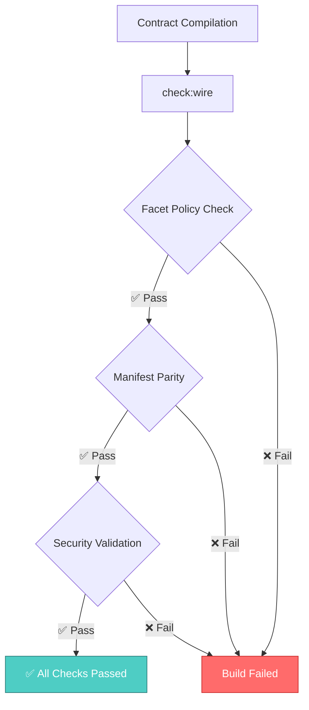

# PayRox Integration Validation System

<div align="center">


**End-to-End Protocol Consistency Validation**

*Ensuring all PayRox components speak the same language*

</div>

---

## 🔍 **What It Validates**

<table>
<tr>
<td width="60" align="center">


</td>
<td>

**Code Quality & Standards**
- Facet policy compliance (no Diamond Loupe in business facets)
- EIP-170 size limits (24,576 bytes max per facet)
- Selector hashing consistency (keccak256 only)
- TypeScript/Solidity interface parity

</td>
</tr>
<tr>
<td width="60" align="center">


</td>
<td>

**Manifest Validation**
- Perfect ABI-manifest selector parity
- Compiled artifacts match deployment manifests
- No phantom or missing function selectors
- ERC-165 centralization enforcement

</td>
</tr>
<tr>
<td width="60" align="center">


</td>
<td>

**System Integration**
- PayRoxProxyRouter security features verified
- Salt policy consistency across languages
- Cross-chain deployment compatibility
- Diamond architecture integrity

</td>
</tr>
</table>

---

## 🚀 **Quick Start**

```bash
# Run integration validation
npm run check:wire

# Run with tests
npx hardhat test --grep "wiring"

# Full CI simulation
npm run check:wire && npm run lint && npm run test:integrity
```

---

## 📊 **Validation Flow**



---

## ✅ **Protocol Guarantees**

When `npm run check:wire` passes, PayRox ensures:

- **🏗️ Architecture Integrity**: Clean Diamond facet separation
- **🔄 Upgradeability**: Manifest-driven deployment consistency  
- **🛡️ Security**: Router hardening with INIT_SALT protection
- **📏 Standards**: EIP-170 and ERC-165 compliance
- **🔗 Integration**: All components protocol-coherent

---

## 🔧 **Configuration**

The validator is configured in `tools/validate-integration.ts` and includes:

- **Facet Size Limits**: EIP-170 (24,576 bytes)
- **Banned Functions**: Diamond Loupe in business facets
- **Security Checks**: PayRoxProxyRouter hardening features
- **Hash Algorithms**: keccak256 enforcement (no SHA-256)

---

## 📈 **CI Integration**

```yaml
# .github/workflows/quality-gates.yml
- name: 🔗 Wiring / manifest parity check
  run: npm run check:wire
  
- name: Integration wiring test  
  run: npx hardhat test --grep "wiring"
```

---

## 🎯 **Error Categories**

### ❌ **Problems** (Build Fails)
- Facets exposing banned Diamond Loupe functions
- Runtime bytecode exceeding EIP-170 limits  
- Manifest-ABI selector mismatches
- Missing security features in router

### ⚠️ **Warnings** (Review Required)
- Compiled selectors missing from manifest
- Potential SHA-256 usage in tooling
- Missing optional salt policy libraries

---

<div align="center">

**PayRox Integration Validation System**  
*Single red/green signal for protocol coherence*

 

</div>
